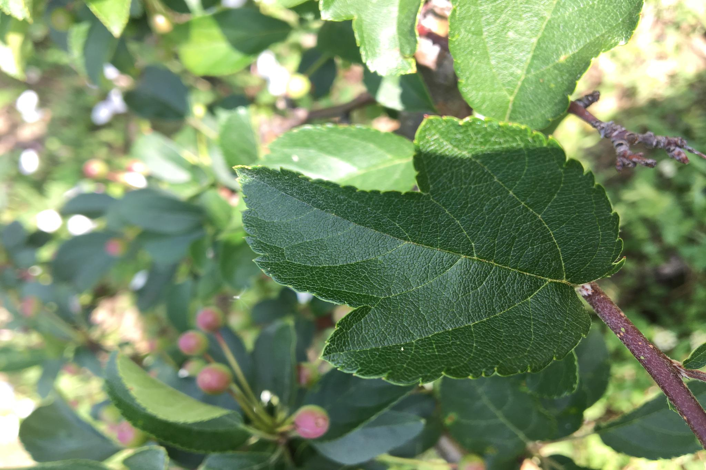
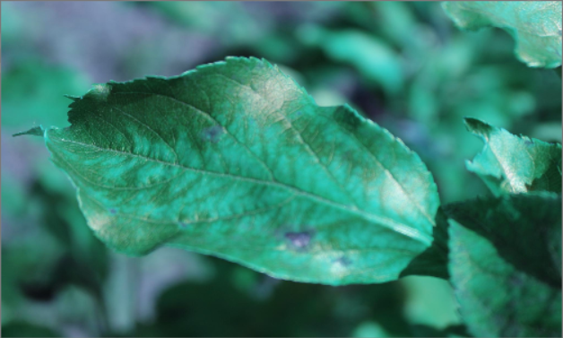
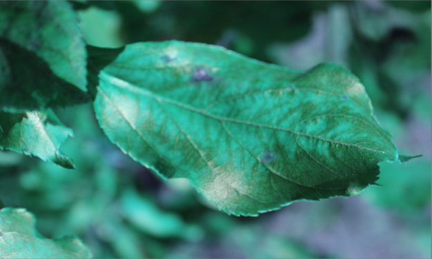
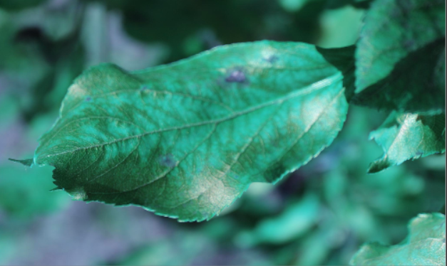
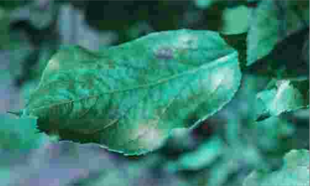
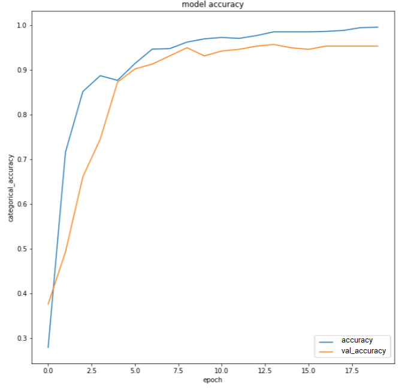
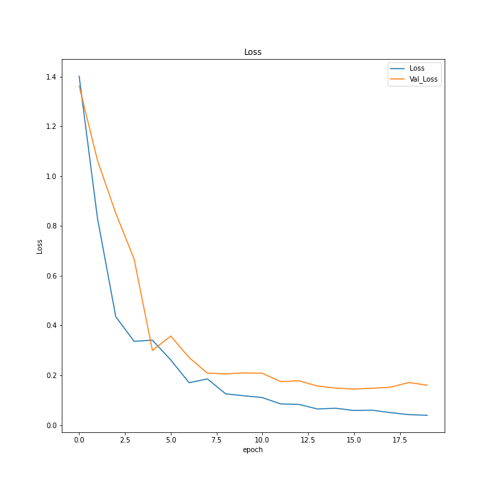
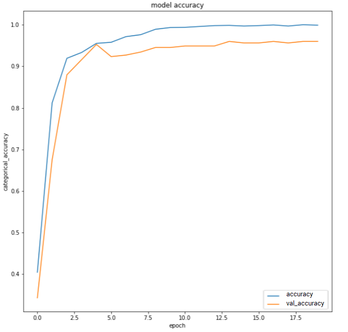
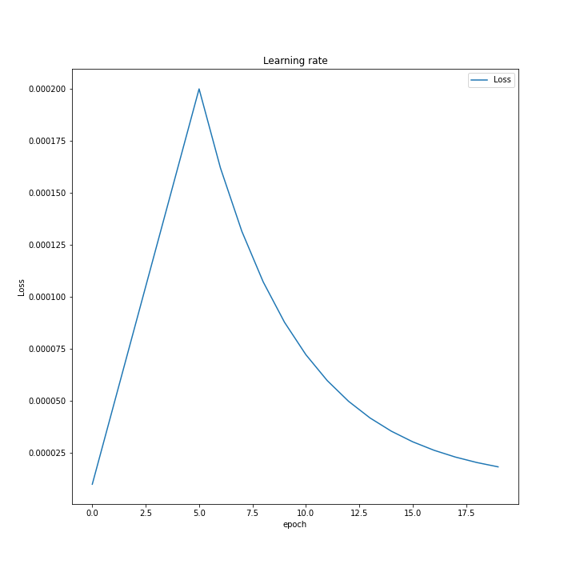

HABRARD Amaury

Context of study: 
==================

Failure to identify the many diseases affecting agricultural crops will
contribute to the misuse of chemicals, contributing to the emergence of
resistant strains of pathogens, higher input prices, and more epidemics
with severe economic losses and environmental impacts. Current human
screening-based diagnosis of disease is time-consuming and expensive,
and while computer vision-based models are efficiently promising, the
high variability of symptoms due to the age of infected tissues, genetic
differences and light conditions in trees reduces the precision of
detection.

Protocol : 
===========

In this part, we are going to explain how we will proceed to reach the
goal of this project. In order to perform with all details around this
study, firstly we will figure out the state-of-art of deep learning
applied to image classification. Secondly, we will talk about our task
which is plant pathology classification by summarising the previous
studies on this field. By the end of this report, we will propose our
model, its parameters and the paradigm of training that we will use in
order to optimize the model.

State-of-art: 
==============

Computer Vision
---------------

Computer vision is an interdisciplinary scientific field that provides
answers on how a computer can acquire knowledge from images and videos.
From an engineering perspective, it seeks to understand and automate the
tasks that the human visual system can perform @vision. Computer vision
tries to bring solutions to problems related to the automation of
certain visual tasks. These include[4] :

### Image Classification: 

Image classification involves a variety of challenges, including point
of view variation, scale variation, intra-class variation, image
distortion, image occlusion, lighting conditions, and background
clutter. Commonly the data-driven approach is used to choose the right
model in order to do the best classification accuracy. Basically the
Convolutional Neural Networks (CNNs) is the most famous architecture
used for image classification.

### Object Detection:

Object detection is different from the Classification Task but uses it
to achieve his goal. The aim of this task is firstly to identify objects
in an image or a video and then to classify each object in order to
produce a list of object categories present in the image along with an
axis-aligned bounding box indicating the position and scale of every
instance of each object category.

### Object Tracking :

The aim of this is to track objects generally in the frame of a video.
It is used basically in real-time context. This exploit is the sum of
many techniques: Firstly in each frame, we have to identify the objects
and then to classify them in one class. At the end, it makes a relation
between the object in successive frames in order to track the object
over the time.

### Semantic Segmentation :

The aim of Semantic Segmentation is to be able to make semantic division
into image. More specifically, the goal of semantic image segmentation
is to label each pixel of an image with a corresponding class of what is
being represented. Because we’re predicting for every pixel in the
image, this task is commonly referred to as dense prediction.

Solution for computer vision: 
------------------------------

Computer vision solutions are on the rise. Every year new techniques and
models are introduced. In order to understand this field it’s essential
to know the basics and the genesis of it. First of all, machine learning
techniques did their introduction in the computer vision field with the
geometric techniques such as Delaunay and Voronoï meshes
@fondationvision used to perform computer vision tasks. These techniques
were not robust and precise enough for concrete applications. In the
light of the fast development of machine learning techniques and the
processing capacity of computers, the idea of using these techniques on
images has emerged. Now let’s talk about machine learning techniques for
computer science. In fact, the kind of models adapted to Computer vision
comes from the subfield of Machine learning which is Deep Learning.

Deep learning proposes many techniques or models based on the artificial
neural network and a lot of relevant models for Computer Vision. However
most of them have been based on the Convolution Neural Network. So
before diving deep into these different models, let’s bring some
explaining on CNN. The convolution neural network is very similar to the
basic neural network but very special thanks to its capacity for
processing data with a grid such as topology do. In addition, the CNN
with sparse interaction between layers decreased drastically the numbers
of the parameters of the neural network. It is also based on
Equi-variant Representation.

This network consists of multiple layers and we will have to learn the
weights and biases. Let’s note that there is a last fully connected
layer and let’s specify the main function or layer of the CNN.
Basically, in the convolution neural network, there are four kinds of
layers : Convolution Layer, Pooling Layer, Activation layer and
Fully-Connected layer.

-   ** Convolution Layer :** The Convolution layer is usually the
    first layer in CNN where we convolve the image or data using a
    filter or a kernel. Filter are small units that we apply across the
    data through a sliding window (stride). The depth of the filter is
    the same as the input, so for a color image (depth 3) we will apply
    a filter of a depth 3. To clarify this, we will compute the sum of
    elements from Hadamard product (also known as the element-wise,
    entrywise or Schur product) between the image window and the kernel.
    

     [fig:boat1]

-   **Pooling Layer :** It is the most used layer in Convolution
    Neural Network. It is used in order to reduce the dimension of the
    matrix (Image in our case) in order to reduce the computation power
    required during the convolution operation. In the same way, pooling
    layers can reduce the overfitting risks of the model. Indeed, Image
    is a high dimensional data and we know that high dimensional data
    can cause the curse of dimensionality. It can bring up an
    Overfitting problem. So by avoiding it, we will reduce the chances
    of overfitting. Let’s explain the operation of pooling with two
    hyper parameters. Dimension of spatial extent and the stride. The
    stride is how many features the sliding window skips along the width
    and height, which is similar to what we saw in the convolution
    layer. Pooling operation will take a specific value to represent one
    zone of an image according to the kind of pooling used (Max, Min,
    Avg). For the following example in the schema, the dimension is 2\*2
    and the stride is 2. 

     [fig:boat1]

-   **Activation Layer :** In a Convolution Neural Network or generally
    in Any Neural Network, we need a non-linear layer which consists of
    an activation function that takes the feature map generated by the
    previous layer and creates the activation map as its output. The
    activation function is an element-wise operation over the input
    volume and so the dimensions of the input and the output are
    identical.@nonlinear The activation function is the function
    embedded in each of the neurons. Its goal is to normalize the output
    of the neurons depending on the input. Our CNN models will be based
    on DNNs. Let’s compare the following ones.

    -   **Sigmoid :** It’s the most known nonlinear function. It
        prevents output jumps and normalizes the output between 0 and 1.
        Nevertheless, it is known to have a gradient vanishing problem
        happening with high input values. 

    -   **ReLU : (Rectified Linear Unit) : ** This function is
        close to linear one but allows backpropagation. But a
        backpropagation problem happens when the input is close to zero
        or negative. 

    -   **Softmax :** This function is the only one of these three
        to handle multiple classes as input. Typically used to classify
        the outputs. 

-   **Fully Connected Layer :** After getting a feature map from
    the convolution operator, we will learn non-linear combinations of
    features. Essentially the convolution provides a meaningful,
    low-dimensional and invariant feature space. The fully-connected
    layer will learn a nonlinear function from this feature space
    obtained. But the output of the Convolution (Convolution + Pooling)
    is commonly a matrix although the Fully-Connected layer must receive
    a vector. In order to be able to pass the matrix as an input of a
    fully-connected layer, we will apply the flattened operation which
    transforms a matrix in a vector. 

Project Description : 
======================

This project can be viewed as an image classification task in machine
learning(Deep Learning). There are 5 categories : four diseases and
healthy leaves. Our goal is to classify in an accurate way the image of
the leaves in one or multiple categories of diseases. Indeed one leave
can have multiple diseases and our model must be able to detect this
kind of situation.\
**Image Classification** is a fundamental task. The goal is to classify
the image by assigning it to a specific label. Typically, Image
Classification refers to images in which only one object appears and is
analyzed. In contrast, object detection involves both classification and
localization tasks, and is used to analyze more realistic cases in which
multiple objects may exist in an image. [(Image classification)
](https://paperswithcode.com/task/image-classification)

Data description or exploration: 
=================================

Before any formal analysis of the data, we have to know the number of
items and the variables in the data set, the number of missing
observations and the general assumptions the data suggest. To answer
these questions, an initial exploration of the dataset will allows us to
become familiar with the data that will handle. Data exploration or data
description is a very important phase in any machine learning project.
This step allows us to get more details about the dataset which we will
use to train our model.

For our project we got the dataset from kaggle: [Link
](https://www.kaggle.com/c/plant-pathology-2020-fgvc7). The
database folder consists of **3642** images in **jpg** format. Each
image is in **2048** pixels \* **1365** pixels with **3** channels(RGB).
Added to these images, there are three others files.

-   sample\_submission.csv: this is the sample for the submission. We
    will start by simply looking at a few random samples.

-   train.csv: this file contains the training set with its labels. We
    will use it during the training of the model.

-   test.csv: this file will contains the test set.

After describing the files which constituted the dataset, we will
explore it through statistical metrics.

Let’s start with the distribution of the dataset row (image) over the
classes. To sum up this information let’s draw a pie chart  [fig:pie]

[fig:pie]

The amount of photos is quite similar for each target, unless for
multiple diseases class.\

[fig:histo]

Let’s explore the color distribution of images refers to figure
 [fig:boxplot]:

[fig:boxplot]

Now, let see the distribution on the histogram, confer figure :

[fig:boxplot]

We can notice that the color distribution shape for each channel is
quite similar with some shifts. Of course the green one is the most
prominent. From this point, we can suppose that the model classifying
process may rely on this distribution.

After the exploration of the data we will go on to the preparation of
the data in order to make it easy for the extraction of knowledge on the
model.

Data preparation :
==================

Data augmentation is the concept aiming to slightly modify the original
database in order to make it clean. A clean database allows a more
exhaustive learning and prevents more overfitting. The different
techniques used in data augmentation and preparation have to rely on the
specific application needs. In the context of computer vision, we speak
about image preparation. There are several techniques coming from the
potential, pictures environment related, image distortion. These can be
due to the diversity of devices leading to different processing of the
the same captured picture. Weather conditions or the point of view that
the photograph has chosen for his pictures can also influence the
picture. The image preprocessing techniques aim to to simulate those
diverging behaviours.\

This is a crucial part for our study. Indeed, performing Image
classification implies dealing with high dimensions data. So in order to
facilitate the training of the data in this crucial context, we have to
prepare images. We use the following process :

Canny edge detection :
----------------------

Canny edge detection is an edge detection algorithm as noticed by its
name. It was created by John F. Canny in 1986. The algorithm involves in
several steps.

**Noise reduction:** Since edge detection is susceptible to noise in an
image, we remove the noise in the image using a 5x5 Gaussian
filter@guassian. So recall the Gaussian function in one dimension also
call function of density:

$$P(x) = \frac{1}{{\sigma \sqrt {2\pi } }}e^{{{ - \left( {x - \mu } \right)^2 } \mathord{\left/ {\vphantom {{ - \left( {x - \mu } \right)^2 } {2\sigma ^2 }}} \right. \kern-\nulldelimiterspace} {2\sigma ^2 }}}$$
Let’s assume that sigma is the standard deviation of the distribution
(in our case of image). The distribution is assumed to have a mean of 0.
More simply will reduce the range of the dataset around the mean 0; with
the standard or (ecart-type) 1. Let’s notice that as well as standard
deviation is large the range of the distribution will be large.

In our case we will use the gaussian function on two dimensions as
following :
$$P(x,y) = \frac{1}{{\sigma \sqrt {2\pi } }}e^{{{ - \left( {x^2 + y^2} \right) } \mathord{\left/ {\vphantom {{ - \left( {x^2 + y^2} \right)^2 } {2\sigma ^2 }}} \right. \kern-\nulldelimiterspace} {2\sigma ^2 }}}$$
Now let’s see how we are going to apply this distribution on our dataset
or more clearly how to bring back our distribution in normal
distribution. Firstly we have to compute the standard deviation and mean
of each dimension of distribution of the images. After that, for each
value we can do the values minus the mean in order to get the mean of
the distribution to 0. And we have to divide the result value with the
standard of derivation in order to get the standard of derivation to 1.
With these metrics we can define the Gaussian functions in the image
field this function is a kernel or matrix. After getting a Gaussian
kernel which is a matrix, we have to apply convolution operation between
the kernel and each image or each channel of image.

**Finding Intensity Gradient of the Image @gradient: ** First, the
gradient in computer vision is the directional change in image if we
loop on coordinate. Now we have to compute edge gradient and Angle of
gradient. Let consider the image I represented in a matrix, the gradient
in the pixel with the coordinates x=c and y=r can be compute as follows
:

$$dx = I(c+1, r) - I(c-1,r) \\\
    dy = I(c,r+1) - I(c,r-1)$$

This means calculating the partial derivative of the function
represented in our case by the matrix. I(x,y) is a luminosity in one
channel The gradient magnitude is how strong is the change of the
luminosity if we can position it in image. To find the Intensity
Gradient of the Image, we need two metric : The gradient orientation and
the Edge Gradient. The gradient orientation is computed as followed :

$$\theta = \tanh^{-1}{(dx^2 + dy^2)}$$

The magnitude or edge gradient equals :

$$Magnitude = \sqrt{(dx^2 + dy^2)}$$

**Rounding : ** The gradient is always perpendicular to edges. So, it is
rounded to one of the four angles representing vertical, horizontal and
two diagonal directions.

**Non-maximum suppression : ** After getting the gradient
magnitude and direction, a full scan of the image is done to remove any
unwanted pixels which may not constitute the edge. For this, we check
every pixel for being a local maximum in its neighborhood in the
direction of the gradient. 

**Hysteresis Thresholding:** This stage decides which parts are
edges and which are not. For this, we need two threshold values, minVal
and maxVal. Any edges with intensity gradient greater than maxVal are
considered edges and those lesser than minVal are considered non-edges,
and discarded. Those who lie between these two thresholds are classified
edges or non-edges based on their neighborhood. If they are near
“sure-edge” pixels, they are considered edges, and otherwise, they are
discarded. 

 [fig:sub1]

 [fig:sub2]

[fig:test]

The result of these five steps is a two-dimensional binary map (0 or
255) indicating the location of edges on the image.

With this method we reduce the size of the image to focus only on the
leaf. We cropped the Image as we can see on the following screen.

[fig:scaling]

Flipping : 
-----------

Flipping is a simple transformation that involves index switching on
image channels. In vertical flipping, the order of the lines is
exchanged. In vertical flipping, the order of the lines is exchanged.
Let’s assume that “long” and the “lag” is the size of the In order to
perform the horizontal flipping the pixel (x, y) will be situated at
coordinate (long - x + 1, y) in the new image.\

-   Horizontal Flip :

    $$Horizontal Flip:  A_{ij} = A_{i(long +1 -j)}$$

-   Vertical Flipping :

    $$Horizontal Flip:  A_{ij} = A_{(lag +1 -i)j}$$

 [fig:sub1]

 [fig:sub2]

[fig:test]

Gaussian blur and Compression : 
--------------------------------

As we know that sometimes the image quality taken for prediction can be
a bad one, we have to consider the quality of this image by making our
model more robust. Blurring is simply the addition of noise to the
image, resulting in a less-clear image. The noise can be sampled from
any distribution of choice, as long as the main content in the image
does not become invisible. Only the minor details get obfuscated due to
blurring. We can also use the image compression algorithms in order to
decrease the image quality, in view to make the mode The following image
is set to 90% jpeg compression.

 [fig:sub1]

 [fig:sub2]

[fig:test]

Data Augmentation
-----------------

Approaches of our model: 
=========================

In order to choose the most efficient model for our task of
classification, we have decided to collect different benchmarks over
recent papers which perform image classification in general and more
precisely which perform plant pathology’s detection tasks. In view of
the constraints of the domain due to the low power of the device which
will host this model, we have to find the most efficient model which
requires less memory space and computation power. To reach our goal, we
read the following articles : @canny, [link
](https://paperswithcode.com/task/image-classification)
@stateOfArt. The website [link 
](https://paperswithcode.com/task/image-classification) presents
in a synthetic way the benchmarks. Through these papers and benchmarks,
we keep on our notebook the following models: ResNet, and EfficientNet.
Before diving deep into these models let’s notice that in order to gain
efficiency, we will train these models in transfer learning context.
Transfer Learning is the ability to reuse an trained model to solve
other problems. The main purpose of Transfer learning is efficiency
during training. It has been proven that training a model from scratch
is more expensive than training a model from a pre-training model. In
our case, our model was pre-trained on [ImageNet 
](http://www.image-net.org/). Let talk about the selected models
:

ResNet :
--------

ResNet stands for Residual network. This model appears in response to
the gradient vanishing problem[10] in Convolution Neural Network with a
large depth. Let explain the context of apparition of this model. In the
past to increase accuracy of image classification tasks, the basic
approach was to scaling up the model. By adding more layers of
convolution to the model or make greater the width of the network. The
following schema  [fig:scaling] will explain different kinds of scaling
up.

[fig:scaling]

But in this way, we need more and more power to compute the weights of
this kind of network. After a long time spent scaling up a single
dimension at the same time(either channel, either width either depth) of
the networks in order to improve the accuracy of classification, a main
problem has been observed. This problem is the gradient vanishing
problem @vanishing. As more layers using certain activation functions
are added to neural networks, the gradients of the loss function
approaches zero, making the network hard to train. Some activation
functions, such as the sigmoid function, compress a large input space
into a small input space between 0 and 1, so a large change in the
sigmoid function input will result in a small change in the output.
Consequently, the derivative becomes small. For a shallow network with
only a few layers using these activation’s function, this is not a big
problem. However, when multiple layers are used, the gradient can be too
shallow for the training to perform well. The gradients of the neural
networks are determined using back-propagation. In very simple terms,
back-propagation is used to find network derivatives by moving layer by
layer from the top layer to the bottom layer. According to the chain
rule, the derivatives of each layer are multiplied in the network (from
the final layer to the initial layer) to calculate the derivatives of
the initial layers. However, when n hidden layers use an activation like
the sigmoid function, n small derivatives are multiplied together. Thus,
the gradient decreases exponentially as we propagate down to the initial
layers. A small gradient means that the weights and biases of the
initial layers will not be updated effectively with each training. As
these initial layers are often crucial in recognising the essential
elements of the input data, this can lead to an overall inaccuracy of
the entire network.

-   The simplest solution is to use other activation functions,
    such as ReLU, which does not cause a small derivative.

-   Also, batch normalization layers can fix the issue. The
    problem is occurred when a large range of input is mapped to a tiny
    one. Batch normalization reduces this problem by normalizing the
    input.

-   Another solution is the Residual network. It is characterized
    by the residual connections straight to earlier layers. The residual
    connection directly adds the value at the beginning of the block, to
    the end of the block (F(x)+x). This residual link does not go
    through activation functions that “overwrite” the derivatives,
    resulting in a higher overall derivative of the block. 

In view of these problems, we saw the creation of a new network called
Residual neural network ( ResNet ) . The following figure  [fig:resnet]
sums up the new approach :

 [fig:resnet]

The main idea of the ResNet is from Cortex visual of the Human. In fact
they added the highway to the architecture. This highway (having the
identity function on the input) will “amplify” the output change
according to the input change. In the ResNet context of scaling up CNNs,
many variants have been created. To scale up the ResNet architecture we
have to add more layers. For instance From ResNet-18 to ResNet-200, we
add more layers. The obtained network will be more accurate if we can
train it. Now let’s explain our own resnet model. We use **ResNet-50**.
As mentioned in his name it uses 50 layers. Now that our ResNet model
has **23,858,500** parameters, **23,805,380** Trainable parameters and
non-trainable parameters: 53,120. On the top of this ResNet-50 we add
one layer of GlobalAveragePooling2D, another of 128 neurons with relu
function for activation, another one of 64 neurons with relu activation
and the last one with 4 neurons with softmax activation to get the
output like a probability. The optimizer which we have used is the Adam
optimizer. The results that we got will be presented in the result
section of the document.

EfficientNet :
--------------

Once the gradient vanishing problem was solved with the ResNet
architecture, we noticed that there is no formal way to scale up the
network. In fact there is no formal way to choose which dimension
(width, depth or Resolution) scales in which distribution in order to
increase the accuracy and minimize the cost (computational cost, memory
cost). Although we succeeded in training these models, we can see that
the accuracy will be saturated after a certain level of scaling. As
shown in the following figure  [fig:scaling~m~ulti].

[fig:scaling~m~ulti]

Let’s notice that with w = 5.0 (scaling on one dimension width) they got
the saturation of accuracy. With d=8.0 (scaling on one dimension width)
we also get the saturation of accuracy and with r=2.5 we get the
saturation of accuracy. But the researchers noticed that in the
following schema with depth= 2.0 and r=1.3 the saturation event didn’t
occurred.

[fig:scaling~m~ulti]

Each dot is a model with different width. Where here, they conclude that
the right solution can be scaling up the network on multiple dimensions
(depth and resolution). The previous problems or situations caused the
creation of the new approach or technique of scaling up the network on
multiple dimensions. This technique (model) rethinks the way that we
scale CNNs up. In addition, this new technique has posed certain
constraints to be satisfied.

-   maximize the model accuracy for any given resource
    constraints. 

-    To systematically study model scaling and balance the network
    depth, width and resolution.

In more formal way : with the model N, the objective function will be

[fig:scaling~m~ulti]

With the following constraints:

[fig:scaling~m~ulti]

To solve this problem EfficientNet proposes the **Compound scaling
method**. This scaling method tries to balance dimensions of
width/depth/resolution by scaling with a constant ratio. Let’s notice
that this new approach uses an existing architecture and propose a way
to efficiently scale up this one with a Compound scaling method. This
new approach states that :\

$2^n$ more computational resources implies $a^n$ + $b^n$ + $c^2$
additional dimensions on the model.

The coefficient a, b and c are constants determined by a small GRID
SEARCH on the original small model. Let’s notice that $a^n$ is the
additional value to the depth dimension of the model , $b^n$ is the
additional value to the width dimension of the model and $c^n$ is the
additional value to the resolution dimension of the model. The following
equation allows to get the different coefficients :

$$a + b^2 + c^2 \approx 2$$

from the original paper that is formulated as following : Thanks to this
new way, the researchers realized the best accuracy with less parameters
(less resources). As we can show on the following figure  [fig:perf]
from original paper.

 [fig:perf]

We can show on the first row, with EfficientNet-B0 there are 5.3M
parameters and they got as accuracy 77.1% and with ResNet-50 there are
26M and they got as accuracy 76.0 %. The gain of the performance here is
awesome.

We have used EfficientNetB7 adding GlobalAveragePooling layer, 3 Dense
layer as following :

-   dense3 (Dense): with the following shape (None, 128) and
    parameters 327808

-   dense4 (Dense): with the following shape (None, 64) and
    parameters 8256

-   dense5 (Dense): with the following shape (None, 4) and
    parameters 260

We coupled this model with Self-Training Noisy student
@xie2020selftraining. This technique allows us to improve the accuracy
of the model.

Result and Interpretation:
==========================

Result
------

In this section we will present the result of our study. We start with
accuracy and Epochs plot in order to show how the accuracy will increase
over the time.

[fig:dense~a~ccu]

This plot  [fig:dense~a~ccu] shows the convergence of the average. We
got 0.97 as accuracy on the training set and the 0.93 on the test set.
With this last one we can see easily that the model works well on the
training than the training set. Obviously this is normal. Our DenseNet
is a standard CNNs.

[fig:loss~d~ense]

This plot  [fig:loss~d~ense] shows the evolution of the loss value over
the time. Obviously the loss converges to 0 over contrary the accuracy.

[fig:desne~f~ilter~a~ccu]

In this Network we add more filter in image in order to decrease the
quality of this ones and we train our dense with them. This manipulation
is done in order to make the model more robust. The figure
 [fig:desne~f~ilter~a~ccu] shows the accuracy gotten.

 [fig:desne~f~ilter~l~oss]

This is the plot  [fig:desne~f~ilter~l~oss] distribution over the epochs
with the filter applied in the DenseNEt

 [fig:resnet~a~ccu]

This plot  [fig:resnet~a~ccu] shows the distribution of the accuracy of
the epoch with res-net. Obviously we can notice this network make a lot
of time before to converge in a test set. This is due to the effect of
the filter on the training set and also we didn’t apply these filters on
the test set.

 [fig:effiaccu]

This plot  [fig:effiaccu] shows the performance of the EfficientNet on
this Dataset. As specified previously, we have used EfficienNet-B7. We
got a couple of the issues due the size of this network. We fixed it,
and we got as the accuracy 0.91 on the training set and 0.7 on the test
set. We stop training because we got the stack-overflow on Server. But
fro, kaggle and others resources; EfficientNet is the suitable network
for this task.

 [fig:histoty~d~ense]

This plot represents the loss distribution of the EfficientNet-B7 on our
dataset

[fig:histoty~d~ense]

Interpretation : 
-----------------

Form different papers on the Plant pathology detection with Deep
Learning we browsed, the most efficient model was the EfficientNet. But
after long time on the subject with this dataset, we can say that
DenseNet (simple CNN) is more suitable for this specify dataset than the
others. From This result, we can interpret that our dataset is not
enough large, and our server test is not powerful enough to train the
Resnet and EfficientNet to beat the single DenseNet.
